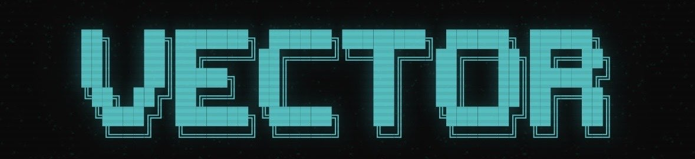

<p align="center">
  
</p>

<h1 align="center">Robotics CTO</h1>

<p align="center">
  <strong>Your AI engineering team for robotics. You lead. Agents build.</strong>
</p>

<p align="center">
  A production-grade Claude Code configuration that turns a single product owner into a full robotics development operation -- with autonomous AI agents handling spec writing, architecture, parallel TDD execution, code review, and documentation.
</p>

<p align="center">
  English | <a href="README_CN.md">中文</a>
</p>

---

## The Problem

Building robotics software requires a full engineering team: architects, developers, QA, technical writers. Hiring is slow, expensive, and hard to scale. AI coding assistants help, but they still need you to micromanage every function.

## The Solution

**Robotics CTO** gives you a complete AI engineering organization inside Claude Code:

```
You (Product Owner)
  |  approve specs, architecture, releases
  v
Dispatcher (Opus) -- routes tasks, prepares executive summaries
  |
  +-- Architect (Opus) ---------- writes specs, designs systems, makes tech decisions
  +-- Alpha (Sonnet) ------------ core developer, parallel TDD execution
  +-- Beta (Sonnet) ------------- core developer, parallel TDD execution
  +-- Gamma (Sonnet) ------------ core developer, parallel TDD execution
  +-- QA (built-in agents) ------ code review, security review, test enforcement
  +-- Scribe (Haiku) ------------ documentation, progress tracking
```

You describe what you want. The agents figure out how, write tests first, implement in parallel, review each other's code, and deliver a completion report. You approve or reject.

---

## How It Works

### Spec-Driven Development + Test-Driven Development

Every feature flows through a disciplined pipeline:

```
DESIGN                                    BUILD
spec.md --> plan.md --> task.md    -->    RED --> GREEN --> REFACTOR
 (what)      (how)      (steps)          (test)   (impl)    (clean)
 [you]       [you]       [QA]            x3 agents in parallel
```

### Decision Boundaries

Not everything needs your attention. The system knows what to escalate:

| Decision | Who Decides | What You See |
|----------|-------------|--------------|
| Function implementation, bug fixes | Agents autonomously | Nothing |
| New components | Architect decides | Brief notification |
| Interface changes, new dependencies | **You approve** | Executive summary |
| Security policy, hardware changes | **You decide** | Detailed report |
| Release to production | **You approve** | Completion report with test results |

### Parallel Execution

Three identical Sonnet agents (Alpha, Beta, Gamma) work on independent tasks simultaneously via git worktrees. A wave of 3 tasks completes in the time of 1.

### Cost-Optimized Model Tiers

| Tier | Model | Role | When |
|------|-------|------|------|
| Reasoning | Opus | Architecture, escalation | Complex decisions only |
| Execution | Sonnet | Development, testing | 90% of all work |
| Utility | Haiku | Documentation, tracking | Run frequently, nearly free |

---

## What's Included

```
robotics-cto/
|-- CLAUDE.md                        # Governance model -- drop into any project root
|-- rules/
|   |-- coding-and-patterns.md       # Style guide, immutability, ROS2 + Python patterns
|   |-- security.md                  # OWASP, secrets management, robotics-specific security
|   |-- testing.md                   # TDD methodology, 80% coverage, 3-layer ROS2 testing
|   +-- workflow.md                  # Git conventions, documentation hygiene
|-- skills/
|   |-- sdd-workflow.md              # Complete SDD+TDD pipeline with templates
|   |-- agent-team.md                # 5-agent team definitions and coordination protocol
|   +-- ros2-development.md          # Lifecycle nodes, QoS, safety-critical patterns, TF2
+-- settings.json.example            # Reference Claude Code configuration
```

---

## Quick Start

Give the link to your agent let it setup for you. 
Or:

### 1. Drop the governance model into your project

```bash
cp CLAUDE.md /path/to/your/ros2_workspace/CLAUDE.md
```

### 2. Install rules globally

```bash
mkdir -p ~/.claude/rules/
cp rules/*.md ~/.claude/rules/
```

### 3. Install skills

```bash
for skill in sdd-workflow agent-team ros2-development; do
  mkdir -p ~/.claude/skills/$skill
  cp skills/$skill.md ~/.claude/skills/$skill/SKILL.md
done
```

### 4. Set up the SDD slash command

```bash
mkdir -p ~/.claude/commands/
cat > ~/.claude/commands/sdd.md << 'EOF'
---
description: "SDD+TDD workflow. spec.md -> plan.md -> task.md -> parallel TDD."
---
# SDD Command
$ARGUMENTS
See skill: sdd-workflow for full workflow.
EOF
```

### 5. Apply settings (optional)

```bash
# Review first, then merge with your existing ~/.claude/settings.json
cat settings.json.example
```

### 6. Start building

```
/sdd init "Add LIDAR obstacle avoidance node"
```

The Architect agent writes a spec. You review a one-paragraph executive summary. Approve, and the pipeline runs autonomously until delivery.

---

## Commands

| Command | Action |
|---------|--------|
| `/sdd init <description>` | Start a new feature -- creates spec with testable acceptance criteria |
| `/sdd spec` | Generate or revise the specification |
| `/sdd plan` | Create technical plan with test strategy per module |
| `/sdd tasks` | Decompose into TDD-structured tasks with dependency graph |
| `/sdd execute` | Launch parallel TDD execution across Alpha/Beta/Gamma |
| `/sdd status` | Current phase, progress, and test metrics |
| `/sdd review` | Submit current phase for your review (executive summary) |
| `/sdd approve` | Approve and advance to next phase |

---

## ROS2-Native

The toolkit ships with production patterns for ROS2 Humble:

- **Lifecycle nodes** -- deterministic startup/shutdown for all hardware interfaces
- **QoS strategy matrix** -- RELIABLE for commands, BEST_EFFORT for high-frequency sensors
- **Launch file patterns** -- parameterized sim/real switching
- **Safety-critical rules** -- no dynamic allocation in RT paths, watchdog timers, E-stop independence
- **3-layer testing** -- unit (pytest/gtest), integration (launch_testing), system (simulation)
- **TF2 frame conventions** -- standard transform tree management
- **Component containers** -- zero-copy intra-process communication

---

## Adapting to Other Stacks

The governance model, SDD+TDD methodology, and agent team architecture are **stack-agnostic**. To use with a different framework:

1. `CLAUDE.md` -- replace the tech stack section
2. `rules/` -- swap build/test commands for your toolchain
3. `skills/ros2-development.md` -- replace with your domain patterns
4. Everything else works as-is

---

## Background

Built and battle-tested at [Vector Robotics](https://github.com/yusenthebot) -- developing autonomous navigation stacks, robotic arm control (SO-101 + MoveIt2), and perception pipelines. This configuration runs real ROS2 development daily with Claude Code as the entire engineering team.

## License

MIT
